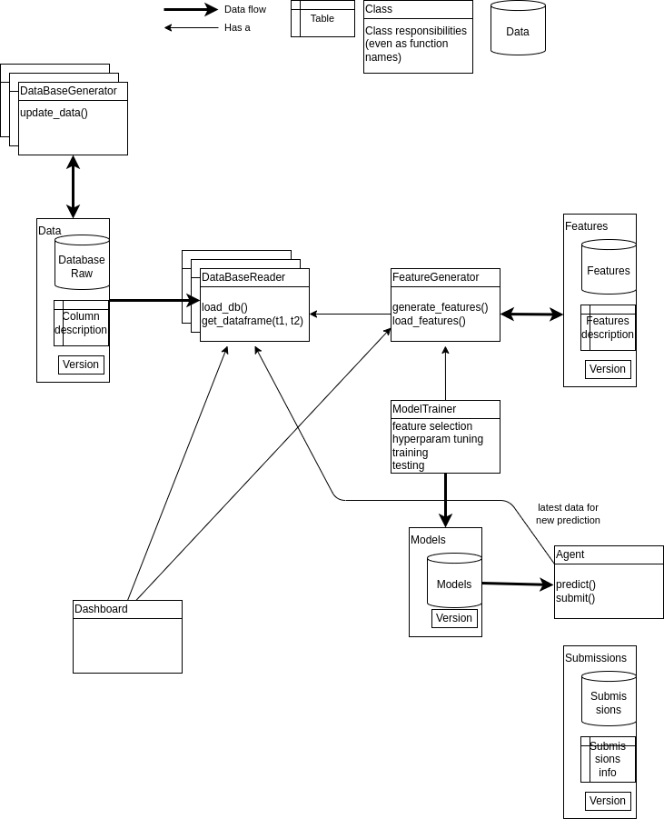

# numerai_signals_bot

## Starting point

Initial code based on the example provided in https://signals.numer.ai/tournament -> download example.

Requirements:

1. Conda installed.
2. pip-tools installed: `pip install pip-tools`

Steps:

1. Run `make all` to create the conda environment and install the dependencies.
2. Run `./api/run_all.sh` to download the data and run the example.

Alternatively run and explore in the notebook `notebooks/run_all.ipynb`.

## Proposed architecture and workflow

