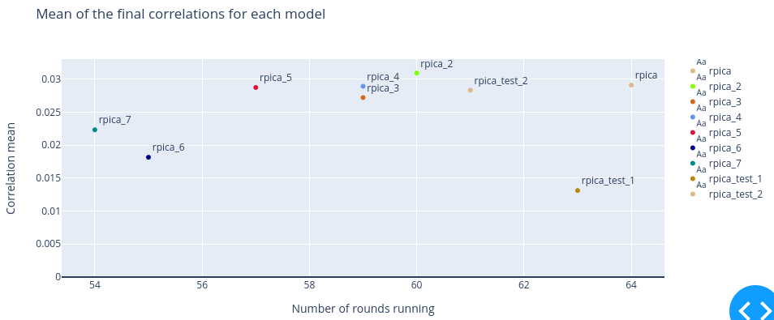

# numerai_signals_bot

## Starting point

Initial code based on the example provided in https://signals.numer.ai/tournament -> download example.

Requirements:

1. Conda installed.
2. pip-tools installed: `pip install pip-tools`

Steps:

1. Run `make all` to create the conda environment and install the dependencies.
2. Run `./api/run_all.sh` to download the data and run the example.

Alternatively run and explore in the notebook `notebooks/run_all.ipynb`.

## For pull-request

Please enforce the following steps before submitting a pull-request:
`pre-commit run --all-files`

## Proposed architecture and workflow

## Dashboards available

Correlation of each submission for each day, as the correlation is estimated and published by Numerai.

Final correlation for each model each round. This is the final correlation of your submission, which will be used to calculate your reward.

Average correlation vs number of rounds for each model. More correlation for more rounds is a good sign of strength and stability, and this dashboard is useful to compare models and decide which one to stake on.

## Future work

- Dashboard to show historical data: it can be just taking the previous one and adapting it.
- Dashboard to show expected performance from current models.
- Add data source as new DatabaseGenerator: FRED
- Move the stored data to AWS S3.
- Create FeatureGenerator with generate_features and load_features. First set of feats being those now in create_initial_database.
- Improve speed with pickle and a check for dates available.
- Make FeatureGenerator faster by using multi-threading.
- ModelTrainer to save the model trained along with any potential pipeline (sklearn pipeline) or configuration (list of features used)
- Make a test configuration and the possibility to use it.